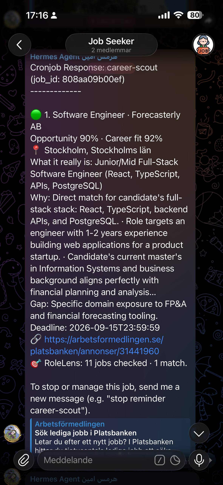
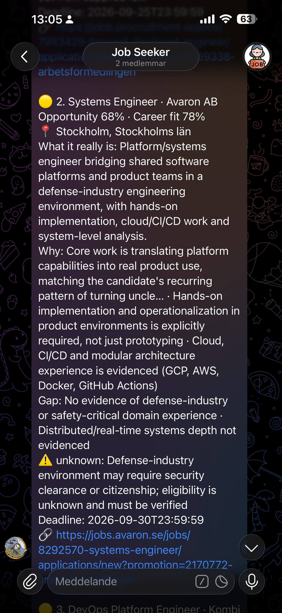

# RoleLens

**Find work that fits, beyond the job title.**

RoleLens is a lightweight semantic job-discovery agent that evaluates real role
fit using LLMs, deterministic policies, and a durable SQLite queue.

Keyword alerts fail in both directions. They flood you with vacancies that
happen to contain the word "engineer", and they hide the role that describes
exactly your job under a title you never thought to search for. RoleLens reads
the advertisement instead of matching its title.

```text
Platsbanken (Arbetsförmedlingen JobSearch API)
    ↓
fetch + normalize
    ↓
SQLite durable queue
    ↓
new/changed jobs
    ↓
LLM semantic evaluation
    ↓
deterministic policy layer
    ↓
ranked notifications
```

It runs as a scheduled script on a small VPS. No agent loop, no browser
automation, no vector database, no Redis, no Docker, no queue broker, and no
third-party Python package at runtime.

---

## What it looks like

RoleLens evaluates the actual work behind a vacancy, explains why it may fit,
highlights gaps and uncertainties, and sends the strongest opportunities to your
preferred channel.

### Strong match



Both scores high: the work itself fits, and nothing in the advertisement stands
in the way.

### Fit with gaps and uncertainty



The same shape of output, judged honestly. The work still fits, but the gaps are
named and an eligibility question is flagged as *unknown* rather than guessed at
— which is why `opportunity_score` sits below `career_fit`.

---

## Two scores, not one

A single "match score" cannot answer the only two questions that matter, because
they have different answers.

**`career_fit` — is this the kind of work I want?**
How well the actual day-to-day work matches your evidence-backed capabilities,
judged independently of whether you can practically get this particular job.
Language requirements, location, citizenship, clearance and seniority never
reduce `career_fit`.

**`opportunity_score` — is this specific vacancy worth pursuing?**
What is left after the practical reality of *this* advertisement: mandatory
language requirements, seniority, specialist stack gaps, location, security
eligibility, deadlines.

Keeping them apart is what makes the output useful. A role with
`career_fit 95 / opportunity_score 30` tells you something precise and
actionable — this is exactly your work, but something in the advertisement
blocks you — and that is information a single blended number destroys.

---

## How a job becomes a notification

1. **Discovery.** RoleLens runs many small searches against the
   Arbetsförmedlingen JobSearch API. Discovery costs nothing and consumes zero
   LLM tokens, so it is deliberately over-inclusive: it would rather retrieve a
   somewhat irrelevant advertisement than miss a hidden-fit role.
2. **Normalization and persistence.** Each hit is normalized into a job record
   and upserted into SQLite under a `UNIQUE(source, source_job_id)` key. A
   SHA-256 content hash of the meaningful fields decides whether an advertisement
   has genuinely changed.
3. **Snapshot selection.** Jobs with no evaluation for the current content hash
   *and* the current profile version are pending. The run takes them **once**, as
   a frozen snapshot that is never re-queried, so a vacancy discovered mid-run
   belongs to the next run and this run stays auditable. Reposts of an
   already-evaluated vacancy are suppressed before they can cost a model call.
4. **Semantic evaluation.** The whole snapshot is evaluated, in sequential
   batches of at most 10, with a JSON-schema-constrained output contract. The
   candidate profile is sent once per batch, not once per job. There is no
   per-run job cap: batch size is bounded, throughput is not.
5. **Validation.** Every requested `source_job_id` must come back exactly once.
   A batch that comes back short is a *completeness gap*, not a failure — its
   valid rows are saved and later batches continue. Omitted IDs get exactly one
   bounded cleanup pass at the end of the run.
6. **Deterministic policy layer.** The model's own `decision` field is never
   trusted. RoleLens applies narrow, auditable rules to the model output and
   then derives the decision itself from validated scores and blockers.
7. **Notification.** Only after every batch has completed are matches ranked
   **globally** and printed to stdout, deduplicated, followed by exactly one
   compact run-summary line. Ranking after the fact is what stops the strongest
   opportunity being buried because it happened to appear late in the queue.
   Operational logs go to stderr, so stdout can be delivered verbatim to a chat
   channel by any scheduler.

There is no auto-apply. RoleLens tells you what to look at; you decide what to
do about it.

---

## Quick start

Requires Python 3.11+ on Linux or macOS. The application uses `fcntl` for its
run lock, so it does not run on Windows without modification. There is nothing
to `pip install`.

```bash
git clone https://github.com/Aminhashemi-su/RoleLens.git
cd RoleLens
```

**1. Install.** This creates `~/.rolelens/` and fills in anything that is
missing from the shipped examples. It never overwrites a file you already have.

```bash
chmod +x install.sh
./install.sh
```

```text
~/.rolelens/
  config.json                      <- from config.example.json
  secrets.env                      <- from secrets.env.example, mode 600
  profile/career_profile.json      <- from career_profile.example.json
  profile/matcher_profile.json     <- from matcher_profile.example.json
  profile/search_lenses.json       <- from search_lenses.example.json
  profile/matcher_rules_v1_1.json
  data/
~/.local/scripts/rolelens.py
```

Override either location with `ROLELENS_HOME` and `ROLELENS_SCRIPTS_HOME`.
Re-running the installer refreshes `rolelens.py` and leaves everything else
alone; `./install.sh --refresh-config` opts into overwriting config and profile
from the checkout, and still never touches `secrets.env`.

**2. Make the profile yours.** Everything installed above describes a fictional
example candidate, so RoleLens will happily match jobs for someone who does not
exist until you edit it.

```bash
$EDITOR ~/.rolelens/profile/matcher_profile.json   # the one sent to the model
$EDITOR ~/.rolelens/profile/career_profile.json    # your local evidence base
$EDITOR ~/.rolelens/config.json                    # search terms and locations
```

`matcher_profile.json` is the one that matters most: it is the compact profile
actually sent to the model on every run. `career_profile.json` is your fuller
evidence base, kept locally so the compact profile can be derived from something
concrete — RoleLens never sends it to a provider.

**Set your language level** while you are in there:

```json
"constraints": { "swedish": "A2, progressing" }
```

See [Language proficiency](#language-proficiency) below. This value is
configuration, not code — nothing in `rolelens.py` assumes a level.

**3. Add provider credentials.**

```bash
$EDITOR ~/.rolelens/secrets.env
chmod 600 ~/.rolelens/secrets.env
```

**4. Check the installation, then spend money deliberately.**

```bash
python3 ~/.local/scripts/rolelens.py doctor            # config only, no network, no cost
python3 ~/.local/scripts/rolelens.py --verbose fetch    # discovery only, zero LLM cost
python3 ~/.local/scripts/rolelens.py status             # local counters
python3 ~/.local/scripts/rolelens.py --verbose evaluate  # first step that calls a provider
```

`doctor` tells you exactly what is still outstanding. It reports
`unedited_example_profiles` while the profile is still the shipped example,
`missing_credentials` until `secrets.env` is filled in, the resolved
`candidate_swedish_level`, and `ready: true` once both are done. It makes no
provider calls and costs nothing.

**5. Switch from backlog to live.** The first `fetch` stores a large historical
backlog. When you are ready to stop evaluating it and only see new or changed
vacancies:

```bash
python3 ~/.local/scripts/rolelens.py activate
```

---

## CLI

| Command | What it does |
|---|---|
| `run` | Fetch, evaluate, emit new matches. The default. |
| `fetch` | Discovery and persistence only. No LLM call, no cost. |
| `evaluate` | Evaluate already-stored pending jobs only. |
| `doctor` | Validate local configuration and credentials without network calls. |
| `status` | Print database counters: totals, pending, mode, live cutoff. |
| `activate` | Freeze the historical backlog; future runs see only new/changed jobs. |

Global flags: `--home PATH` (default `~/.rolelens`, or `ROLELENS_HOME`)
and `--verbose`.

Exit codes: `0` success or recoverable partial, `2` expected operational failure
(bad configuration, permanent provider failure, total discovery failure), `1`
unexpected failure, `130` interrupted.

---

## Configuration

`config.json` — see `config.example.json` for a working starting point.

| Key | Meaning |
|---|---|
| `search_terms`, `location_terms` | Cross-producted into the discovery queries. |
| `include_unlocated_searches` | Also run each term without a location. |
| `search_limit` | Hits per query, capped at 100. |
| `max_candidates_per_run` | **Emergency ceiling** on snapshot size (default 300, cap 500). Not a throughput cap — see below. |
| `max_jobs_per_batch` | Jobs per model call (default and cap 10). |
| `max_run_seconds` | **Emergency** wall-clock budget (default 3000). A batch only starts if its worst case fits. |
| `max_prompt_chars`, `max_job_description_chars` | Prompt size guardrails. |
| `max_notifications_per_run` | Cards emitted per run. |
| `preferred_locations`, `high_signal_title_terms` | Inputs to the cheap discovery score. |
| `northern_exclusions` | Locations pre-filtered out unless the role is fully remote. |
| `jobsearch_timeout_seconds`, `gateway_timeout_seconds`, `http_retries` | Transport limits. |

Most of these are cost guardrails, not semantic rejection rules. Anything not
evaluated in a run stays pending for the next one.

`max_candidates_per_run` and `max_run_seconds` are different: they are
**emergency valves, not throughput caps**. One bounds how much of the pending
queue a single run will hold in memory, the other bounds wall clock. A normal
run never reaches either. When the candidate ceiling *is* reached the run says
so explicitly in its summary, because a truncated snapshot is not a complete
picture of the market and must not be reported as one.

### Language proficiency

The candidate's proficiency lives in `matcher_profile.json`, never in the code:

```json
"constraints": {
  "swedish": "A2, progressing"
}
```

Accepted values are CEFR levels (`none`, `A1`–`C2`) or plain words that map onto
them: `beginner`/`basic` → A1, `intermediate` → B1, `upper intermediate` → B2,
`advanced`/`professional`/`fluent` → C1, `native` → C2. Case does not matter, and
surrounding prose is fine — `"A2, progressing"` and `"B1 (intermediate)"` both
work. An explicit CEFR token always wins, so `"A2, working towards fluent"` is
read as A2.

When an advertisement **explicitly requires** professional, fluent or advanced
Swedish, the policy layer resolves it against your configured level:

| Your level | Outcome |
|---|---|
| C1, C2, fluent, native | **met** — no blocker |
| B2 | **partial** — strong blocker, `opportunity_score` capped at 69 |
| B1, A2, A1, none | **unmet** — hard blocker, `opportunity_score` capped at 49 |
| missing or unparseable | **unknown** — no blocker, no cap, never "unmet" |

C1 is the threshold for "professional working proficiency". B2 is deliberately
penalised rather than hard-blocked: it is close enough that auto-rejecting risks
hiding a good role, and a hidden role costs far more here than a wasted click.

Unknown is a state of its own. A missing level is never read as "none" and never
becomes "unmet" — the requirement stays unresolved and `doctor` tells you the
level is unspecified.

None of this applies to a merely *preferred* Swedish requirement, or to an
advertisement that simply happens to be written in Swedish. Those are never
blockers at any level.

### Work eligibility

Nationality is the one requirement no amount of role fit can rescue, and it is
worded almost identically to a requirement an existing permit already satisfies.
Four optional fields let the policy layer tell the two apart:

```json
"constraints": {
  "swedish_citizenship": "no",
  "eu_citizenship": "yes",
  "permanent_residence": "no",
  "work_permit": "yes"
}
```

| Field | Effect when `"no"` |
|---|---|
| `swedish_citizenship` | Gates the whole feature. Absent, none of this applies. |
| `eu_citizenship` | An EU/EEA nationality demand becomes a hard blocker too. |
| `permanent_residence` | A permanent-residence demand becomes a hard blocker. |
| `work_permit` | Set it to `"yes"` to mark right-to-work requirements **met**. |

**Leaving `swedish_citizenship` out is a real choice, not an oversight.** While
it is absent, an explicit citizenship demand is preserved as `unknown` and the
role is still delivered for you to check yourself. Turning "we do not know" into
"you are rejected" silently loses roles, so the engine will not do it on a guess.
Once you answer, it stops asking.

What then decides the outcome is what the advertisement actually demands:

| Advertisement says | With the profile above |
|---|---|
| "requires Swedish citizenship" | **hard blocker** |
| "citizenship may be required for vetting" | **hard blocker** — a conditional demand cannot be satisfied either |
| "Swedish citizen **or** valid EU work permit" | **met** — a permit route is offered |
| "we cannot offer visa sponsorship" | **met** — the permit is already held |

A background or security *screening* is not a citizenship requirement and never
becomes one on its own. Where an advertisement demands a clearance without tying
it to nationality, that stays `unknown`, exactly as before.

### Scheduler timeout

Whatever runs RoleLens on a schedule — cron, a systemd timer, a CI schedule, a
task runner — its per-task timeout **must be greater than `max_run_seconds`
plus one `gateway_timeout_seconds` of reserve**. With the defaults that is
3000 + 150, so allow at least 3600 seconds.

A run killed externally before its internal budget expires never gets to emit
its summary or mark its notifications, so the work is simply repeated on the
next tick. RoleLens bounds its own runtime; the scheduler only needs to let it
finish.

### Environment variables

RoleLens reads credentials from `secrets.env` inside its home directory, not
from the process environment, because script-only scheduled jobs typically do
not inherit provider credentials from the scheduler.

| Variable | Required | Purpose |
|---|---|---|
| `VERTEX_GEMINI_API_KEY` | yes | Primary evaluator. |
| `VERTEX_GEMINI_MODEL` | yes | Primary model id, e.g. `gemini-3.8-flash`. |
| `AZURE_OPENAI_API_KEY` | yes | Transport fallback. |
| `AZURE_OPENAI_BASE_URL` | yes | Azure deployment endpoint. |
| `AZURE_OPENAI_DEPLOYMENT` | yes | Azure deployment name. |
| `AI_GATEWAY_API_KEY` | no | Benchmark tooling only; never used by production routing. |

`doctor` fails if any required value is missing. Keep the file at mode `600`.

---

## Architecture

Full detail, including diagrams, is in [docs/architecture.md](docs/architecture.md).
Day-to-day commands, scheduling and historical recovery are in
[docs/operations.md](docs/operations.md).
The short version:

- **Retrieval** — Arbetsförmedlingen JobSearch, many cheap queries, no LLM.
- **Persistence** — one SQLite file. `jobs`, `evaluations`, `notifications`,
  `runs`, `job_fingerprints`, `meta`. WAL journal, foreign keys on.
- **Provider routing** — Gemini is primary. Azure is a **transport-only**
  fallback, called at most once per batch and only for a transport, timeout,
  rate-limit, unavailable or temporary 5xx failure. A successful HTTP 200 with
  malformed content never triggers the fallback, because a second provider
  cannot fix a semantic problem.
- **Structured output** — a JSON schema is enforced natively by both providers,
  and completeness is verified afterwards regardless.
- **Deterministic policy layer** — the part that decides. See below.
- **Completeness** — a run evaluates its whole frozen snapshot in sequential
  batches of at most 10, then ranks globally and delivers once. A short batch is
  a completeness gap, not a failure, and gets one bounded cleanup pass.
- **Recovery** — durable pending queue; pending-ness is derived from state, so
  an interrupted run leaves the queue correct.

### Why the model does not get the last word

The model returns scores and blockers. RoleLens then applies a small set of
narrow, auditable rules before deriving the decision itself:

- An advertisement *written* in Swedish is not a Swedish-language requirement.
- Only an explicit mandatory fluent/professional Swedish requirement is a hard
  blocker; "Swedish is a merit" is not, and an explicit "Swedish is not
  required" overrides any mandatory-sounding phrase elsewhere in the same ad.
- Ordinary background screening is not a citizenship or clearance requirement.
- An explicit citizenship or clearance requirement that the candidate's evidence
  does not resolve stays **unknown** — it never silently becomes *unmet*.
- A tenure requirement with no supporting evidence is unknown, not failed.
- Any genuinely unmet mandatory requirement becomes a hard blocker, and a hard
  blocker always suppresses notification.

Only then is the decision computed, from validated numbers:

| Decision | Condition |
|---|---|
| `store_no_notify` | any hard blocker, or nothing else matches |
| `notify_verify` | a genuine unknown eligibility blocker, `career_fit ≥ 85`, `opportunity_score ≥ 55` |
| `notify_strong` | `opportunity_score ≥ 85` |
| `notify_good` | `opportunity_score ≥ 70` |
| `notify_stretch` | `opportunity_score ≥ 60` |

---

## Tests

```bash
python3 -m unittest discover -s tests -v
```

109 tests. No network, no API key, no cost. They cover the decision classifier,
the Swedish-language policy rules, provider routing and fallback semantics,
database idempotency and re-queueing on content change, snapshot completeness,
completeness gaps versus transport failures, the bounded cleanup pass, global
ranking and delivery ordering, the emergency runtime budget and candidate
ceiling, repost suppression, the run-summary wording in every state, the
language-level scale and policy at every level, fresh-clone installation, and
the doctor onboarding states.

---

## Benchmark

[`benchmark/`](benchmark/) contains a reusable provider benchmark and a
synthetic ten-case sample set covering the error classes that actually matter
here: mandatory Swedish, Swedish-preferred, a Swedish-language advertisement
with no language requirement, background screening, an explicit citizenship
requirement, an adjacent DevOps role, a specialist stack mismatch, a seniority
mismatch, a strong match, and an obvious reject.

```bash
python3 benchmark/benchmark_runner.py dry-run                       # no network, no cost
python3 benchmark/benchmark_runner.py run --provider gemini --out results/
python3 benchmark/benchmark_runner.py score results/*.json
python3 benchmark/benchmark_runner.py replay results/gemini.json    # re-derive after a policy change
```

The important design choice: the runner scores the **deterministic decision**,
not the model's self-reported one. It replays every provider response through
the same policy functions production uses. That distinction found two real bugs
during development — see [docs/case-study.md](docs/case-study.md).

Methodology and results are in
[docs/provider-benchmark.md](docs/provider-benchmark.md).

---

## Security and privacy

- **Nothing is committed.** Your `config.json`, your profile files, the database
  and `secrets.env` are all in `.gitignore`. The repository ships only
  `*.example.json` templates.
- **Credentials live in one mode-600 file** inside the home directory, never in
  the repository, never in a URL, never in a log line. URLs are redacted before
  logging.
- **Your CV never leaves your machine.** `career_profile.json` is local-only.
  Only the compact `matcher_profile.json` is sent to a provider, and you choose
  what goes in it.
- **Job data goes to a third-party model.** Vacancy text is sent to your
  configured provider for evaluation. That is the whole design, but be aware of
  it and of your provider's data-retention terms.
- **Provider responses are archived locally** under the home directory
  (`data/last_*_response.txt`, `data/model_failures/`) for debugging. They are
  gitignored; delete them if you do not want them.
- **No auto-apply, no outbound messages to employers.** RoleLens only reads a
  public API and prints to stdout.
- **The example candidate is fictional.** `profile/*.example.json` describes an
  invented person and invented employers.

---

## Project status

Version **1.5.3**. Running daily in production for a single user, against the
Swedish market, since 2026. It is a personal tool published because the design
is more broadly interesting, not a product.

It is deliberately narrow:

- One source (Arbetsförmedlingen JobSearch) and one market.
- One candidate profile per installation.
- One primary provider and one transport fallback; routing is fixed in code.
- Adjacent and specialist roles are still the weakest judgment area, and it
  over-notifies there.
- Output is stdout only; delivery is whatever your scheduler does with it.

Contributions and forks are welcome under the MIT licence. See
[CHANGELOG.md](CHANGELOG.md) for version history.

## Licence

MIT — see [LICENSE](LICENSE). The licence covers this code, its documentation
and its synthetic example data. It does not grant rights to job advertisement
content retrieved at runtime, which belongs to its respective owners.
