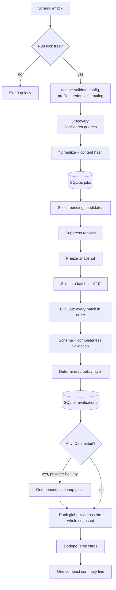
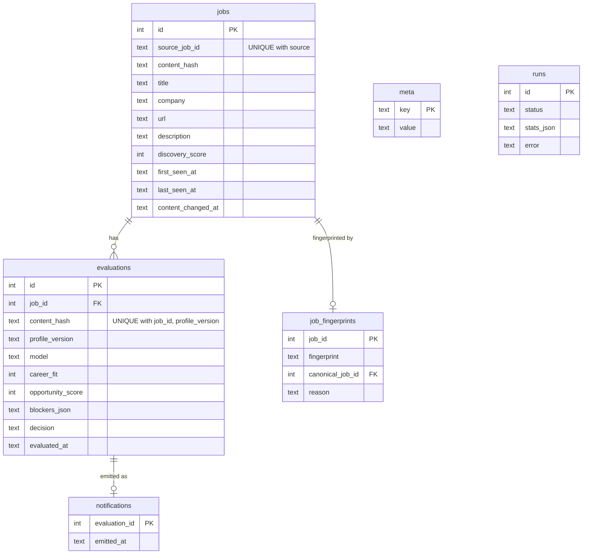
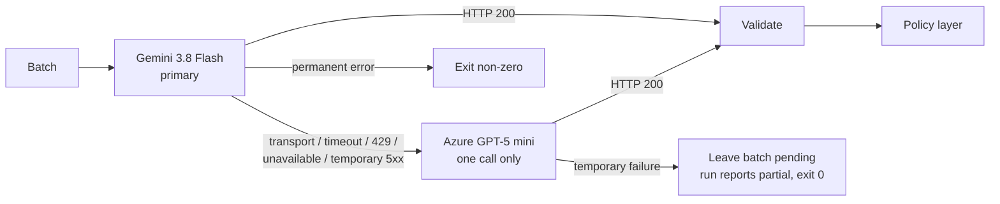
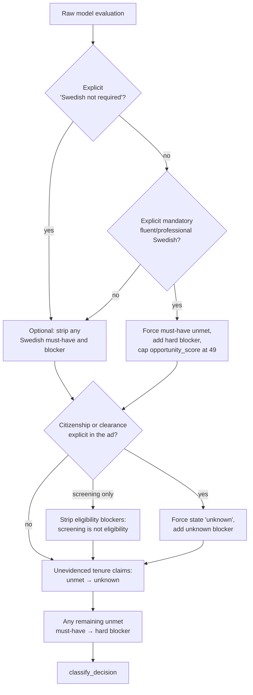

# Architecture

RoleLens is a single Python file with no runtime dependencies outside the
standard library, one SQLite database, and one scheduled invocation. Everything
below describes `rolelens.py`.

The design constraint that shaped all of it: **a scheduled script gets one shot
per tick, unattended, and must never lose a job or silently stop working.**

---

## Run shape



A `fetch` run stops after `UPSERT`. An `evaluate` run starts at `SELECT`.

---

## Retrieval

The Arbetsförmedlingen JobSearch API is public, free, and costs zero LLM tokens,
so discovery is deliberately over-inclusive. `build_queries` cross-products
`search_terms` with `location_terms`, optionally adding each bare term, and
deduplicates case-insensitively. A typical configuration produces 60–100 small
queries per run, spaced by `query_delay_ms`.

Partial failure is tolerated by design: if at least one query succeeds the run
continues and the failed query is logged. If every query fails, the run exits
non-zero so the scheduler surfaces it rather than silently delivering nothing.

`normalize_job` flattens a JobSearch hit into a `JobRecord`: identity, employer,
application URL, municipality/region/country, remote and fully-remote flags,
deadline, employment type, scope, and a merged description. Remote and
hybrid signals are read from both the structured fields and the description text.

A cheap deterministic `discovery_score` ranks candidates before any model sees
them: number of matching queries, high-signal title terms, preferred-location
proximity, remote indication. It decides *order*, never inclusion.

`should_prefilter` drops a job before it can cost anything if it is expired,
outside Sweden, in an excluded location while not fully remote, or has no
description at all.

---

## Persistence

One SQLite file, WAL journal, foreign keys on, `busy_timeout` 5s.



Three keys carry the whole idempotency design:

| Key | Guarantees |
|---|---|
| `jobs UNIQUE(source, source_job_id)` | One row per Platsbanken advertisement, however many queries found it. |
| `jobs.content_hash` | SHA-256 over title, company, url, location, remote flag, deadline, employment type, scope and description. If the employer edits the advertisement, the hash changes and the job becomes eligible for re-evaluation. |
| `evaluations UNIQUE(job_id, content_hash, profile_version)` | One evaluation per (job version × profile version). Change your profile and every stored job becomes pending again under the new profile. |

`profile_version` is a hash over `matcher_profile.json` and `matcher_rules_v1_1.json`,
computed order-independently, so reordering keys does not invalidate work.

### Live vs historical

The first run stores a large historical backlog that you almost certainly do not
want to pay to evaluate. `activate` writes a `live_since` timestamp into `meta`.
After that, candidate selection adds `AND j.content_changed_at >= live_since`, so
only genuinely new or genuinely edited advertisements are selected. Schema v2
added `content_changed_at` and backfilled it from `first_seen_at`, which makes
every pre-existing row historical until it actually changes.

`status` reports both `pending_total` and `pending_live` so the difference is
visible.

---

## Candidate selection

```sql
SELECT j.* FROM jobs j
LEFT JOIN evaluations e
       ON e.job_id = j.id
      AND e.content_hash = j.content_hash
      AND e.profile_version = ?
WHERE e.id IS NULL
  AND j.content_changed_at >= ?      -- only when live mode is active
ORDER BY j.discovery_score DESC,
         COALESCE(j.published_at, j.first_seen_at) DESC,
         j.id DESC
LIMIT ?
```

"Pending" is not a status column that can drift out of sync. It is the absence
of a matching evaluation row — a job is pending exactly when it has no
evaluation for its current content under the current profile. Crash-safety comes
free: an interrupted run leaves the queue correct.

### Repost suppression

Swedish employers frequently repost the same vacancy under a new advertisement
ID. `duplicate_fingerprint` hashes normalized employer, title, location and body
(URLs stripped, punctuation removed, whitespace collapsed). Before evaluation,
any candidate whose fingerprint matches an already-evaluated job is dropped and
recorded in `job_fingerprints` with its canonical job — **before** it costs a
model call. Both source rows survive in `jobs`; only the evaluation is skipped.

A second guard runs at notification time, so a vacancy evaluated before
suppression existed still cannot produce two cards.

---

## Semantic evaluation

### The frozen snapshot

A run takes its candidate set **once**:

```python
candidates = db.pending_jobs(version, ceiling)     # taken once, never re-queried
```

Nothing re-reads the queue mid-run. A vacancy discovered while the run is
working belongs to the next run. This is what makes a run auditable: the set it
was asked to evaluate is fixed before the first model call.

The invariant is **evaluate the complete frozen snapshot before reporting**, not
*process up to N jobs*. `max_batches_per_run` does not exist.

### Batching

`iter_batches` fills a batch until either `max_jobs_per_batch` (10) or
`max_prompt_chars` (180 000) is reached, estimating each job's serialized size.
Batch size stays at 10 because that is where provider completeness was
validated; the number of batches is whatever the snapshot requires. The
candidate profile and rules are sent once per batch, not once per job — that is
where most of the token saving comes from.

`run_batch_pass` walks the batches in order and is used twice: once for the main
pass, once for the cleanup pass.

### Two emergency valves

Neither is a throughput cap, and a normal run reaches neither.

`max_candidates_per_run` (default 300, cap 500) bounds how much of the pending
queue one run holds in memory. If it truncates the snapshot, the run says so
explicitly in its summary — a partial view of the market must never be reported
as a complete one:

```python
ceiling_reached = len(candidates) >= ceiling and eligible_total > ceiling
```

`max_run_seconds` (default 3000) bounds wall clock. A batch only starts if its
*worst case* still fits, and whatever was never attempted comes back to the
caller as deferred rather than lost:

```python
if index and time.monotonic() + reserve_seconds > deadline:
    outcome.deferred.extend(remaining)
    return outcome
```

### Provider routing



Routing is fixed in code. `ProviderMatcher` raises a `ConfigurationError` for any
provider other than the configured primary/fallback pair, and `doctor` fails if
configuration attempts to change it.

The fallback is **transport-only**, and this is the important part: a successful
HTTP 200 carrying malformed or incomplete content does *not* trigger it. A
second provider cannot fix a semantic problem, and retrying one doubles the cost
of a bad prompt. Malformed output is handled by keeping what is valid and
leaving the rest pending.

### Schema validation

Both providers are given the same JSON schema natively — `responseJsonSchema`
for Gemini, `strict` `json_schema` response format for Azure. Each evaluation
must carry `source_job_id`, `career_fit`, `opportunity_score`, `confidence`,
`actual_role`, `why_fit`, `candidate_evidence`, `must_have_assessment`, `gaps`,
`blockers`, `language_risk`, `seniority_risk` and `location_note`.

Native schema enforcement is not trusted on its own. `parse_provider_evaluations`
independently verifies completeness against the requested ID set:

| Condition | Handling |
|---|---|
| Duplicate `source_job_id` | Every copy is discarded; the ID stays unresolved. |
| Unknown `source_job_id` | Discarded and recorded as an error. |
| Missing `source_job_id` | Collected as unresolved; later batches still run. |
| Individually invalid row | Discarded; the rest of the batch is kept. |
| Invalid JSON envelope | Whole batch preserved, and the pass stops. |

### Three outcomes, not one

Conflating "the model omitted two IDs" with "the provider is broken" is what
used to abort a run early. `ProviderBatchResult.error_kind` separates them:

| `error_kind` | Meaning | Effect on the pass |
|---|---|---|
| `completeness` | The envelope parsed. Some requested IDs came back missing or individually invalid. | **Continue.** Valid rows are saved, missing IDs are collected for cleanup. |
| `output` | The envelope could not be parsed at all. | Stop. This batch and all later batches are preserved. |
| `transport` | Both providers failed to answer. | Stop. Same preservation. |

A completeness gap is a normal quirk of schema-constrained generation, not a
failure, and treating it as one silently delayed good roles.

### The cleanup pass

After the main pass, IDs that were never resolved get **exactly one** more
attempt, re-split into fresh batches:

```python
if outcome.unresolved and outcome.provider_error is None:
    cleanup = run_batch_pass(..., cleanup=True)
```

Never recursive, and skipped entirely when the provider already failed this run
— there is no point re-asking something that is broken. Anything still
unresolved afterwards stays pending for the next scheduled run.

The raw content is archived to `data/last_<provider>_response.txt`, or to
`data/model_failures/` when the batch failed.

---

## Deterministic policy layer

This is the layer that decides. `normalize_evaluation_policy` runs on every
evaluation before scores are trusted, and it uses the **job description text**,
not the model's opinion, as its evidence.



Every branch is a narrow, testable rule with an audit trail: the changes it made
are recorded in `_policy_changes` on the normalized item.

The candidate's own proficiency is **not** in this code. It is read once from
`matcher_profile.json` → `constraints.<language>`, normalised onto an ordered
CEFR scale (`none < A1 < A2 < B1 < B2 < C1 < C2`), and passed into the policy
layer. `mandatory_language_outcome()` is the single place that resolves an
explicit mandatory requirement against it:

| Configured level | Status | Blocker | `opportunity_score` |
|---|---|---|---|
| `>= C1` (also fluent, native) | met | none | untouched |
| `B2` | partial | strong | capped at 69 |
| `<= B1` | unmet | hard | capped at 49 |
| unknown / unparseable | unknown | unknown | untouched |

C1 is the documented threshold for "professional working proficiency". Unknown
is a state of its own: it never satisfies a requirement, is never read as
`none`, and never becomes `unmet`. Every explanation string is generated from
the configured level, so no candidate-specific value exists in the engine.

The *detection* rules are a different thing, and they do stay in code — they are
application policy, not candidate configuration. They are regex sets over the
advertisement text:
`SWEDISH_MANDATORY_PATTERNS` (including the word-order variants
`svenska i tal och skrift` and `tal och skrift på svenska`),
`SWEDISH_OPTIONAL_PATTERNS` (merit, meriterande, preferred, a plus), and
`SWEDISH_NEGATION_PATTERNS`, which win over everything else — an advertisement
that says `kunskaper i svenska krävs inte` cannot produce a Swedish blocker
regardless of what other phrases appear in it.

### Decision

`classify_decision` takes only validated numbers and blocker types:

```python
if "hard" in blocker_types:                       return "store_no_notify"
if genuine_unknown_blocker and fit >= 85 and opp >= 55:
                                                  return "notify_verify"
if opp >= 85:                                     return "notify_strong"
if opp >= 70:                                     return "notify_good"
if opp >= 60:                                     return "notify_stretch"
return "store_no_notify"
```

`notify_verify` exists so that a genuinely strong role blocked only by an
*unknown* eligibility question still reaches you, flagged as something to check,
rather than being silently discarded. A `genuine_unknown_blocker` must be typed
`unknown` and actually concern citizenship, clearance, security eligibility or
work authorization — the escape hatch cannot be widened by a vague model
response.

---

## Notification

Delivery happens **only after every batch, including the cleanup pass, has
completed.** Evaluations with a notify decision and no `notifications` row are
then selected and ranked **globally across the whole snapshot** by decision and
`opportunity_score`, capped at `max_notifications_per_run`, and passed through
fingerprint deduplication a second time.

Ranking after the fact rather than per batch is the point: the strongest
opportunity in the snapshot is reported first regardless of which batch produced
it, and can no longer be buried simply because it appeared late in the queue. Each card carries the decision icon, both scores, location, what
the role *actually is*, up to three fit reasons, up to two gaps, up to two
blockers, the deadline and the URL.

Marking notifications emitted and printing happen together, so a crash cannot
produce a delivered-but-unrecorded card or the reverse.

### stdout is a contract

A script-only scheduled job delivers stdout verbatim to a chat channel.
Therefore:

- **stdout** carries user-facing content only: match cards, then exactly one
  summary line.
- **stderr** carries every operational log.
- Every evaluating run ends with a summary line, so a healthy tick is visible
  rather than silent. Empty stdout means the run never reached the matcher.
- A non-zero exit makes the scheduler surface a failure instead of losing jobs
  quietly.

---

## Retry and deferral

RoleLens has no retry queue, because pending-ness is derived from state
rather than stored. Everything degrades into "still pending":

| Failure | Behaviour | Exit |
|---|---|---|
| Some discovery queries fail | Continue with what succeeded | 0 |
| All discovery queries fail | Nothing to persist | non-zero |
| Provider transport/timeout/429/5xx | One fallback call | 0 |
| Both providers temporarily unavailable | `transport`: this batch and all later ones preserved | 0, partial |
| HTTP 200, envelope fine, IDs missing | `completeness`: save valid rows, **keep going**, cleanup pass at the end | 0 |
| HTTP 200 with an unparseable envelope | `output`: this batch and all later ones preserved | 0, partial |
| Emergency runtime budget exhausted | Remaining batches never start, come back as deferred | 0 |
| Candidate ceiling truncates the snapshot | Run reports itself explicitly incomplete | 0 |
| Permanent provider or config error | Fail loudly | non-zero |
| Second concurrent run | `fcntl` lock not acquired, exit quietly | 0 |

Bounded HTTP retry with `Retry-After` support and jittered backoff sits under
all of this, for 408, 409, 425, 429, 500, 502, 503 and 504.

Note what is *not* a partial run any more. Work that is simply queued for next
time — omitted IDs the cleanup pass could not recover, batches the runtime valve
never started — is healthy, and the summary reports it as
`N queued for next run`. Only a genuine provider failure produces
`⚠️ … N pending after provider error` and `status='partial'` in `runs`.
Distinguishing the two is what keeps a scheduled alert meaningful: a warning
that fires on normal operation is a warning nobody reads.

---

## Scheduler integration

RoleLens is invoked as a plain script. It needs no agent loop and no daemon.

Plain cron, delivering to wherever you want the alert to land:

```cron
30 8 * * *  /usr/bin/python3 $HOME/.local/scripts/rolelens.py run 2>>$HOME/rolelens.log
```

Or a systemd timer, if you would rather journald kept the operational log:

```ini
# rolelens.service
[Service]
Type=oneshot
TimeoutStartSec=3600
ExecStart=/usr/bin/python3 %h/.local/scripts/rolelens.py run

# rolelens.timer
[Timer]
OnCalendar=*-*-* 08:30:00
Persistent=true
```

Two operational requirements:

1. **Timeout headroom.** A run evaluates its whole snapshot, so the scheduler's
   per-task timeout must be **strictly greater than `max_run_seconds` plus one
   `gateway_timeout_seconds` of reserve** — at least 3600 seconds with the
   defaults. RoleLens bounds its own runtime; the scheduler only has to let it
   finish. A run killed externally never emits its summary or marks its
   notifications, so the work is simply repeated on the next tick.
2. **Timezone.** Confirm the server's local time before choosing the hour.

Any scheduler works — cron, systemd timers, a CI schedule — as long as it can run
a Python script and do something useful with stdout.
