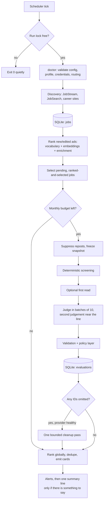
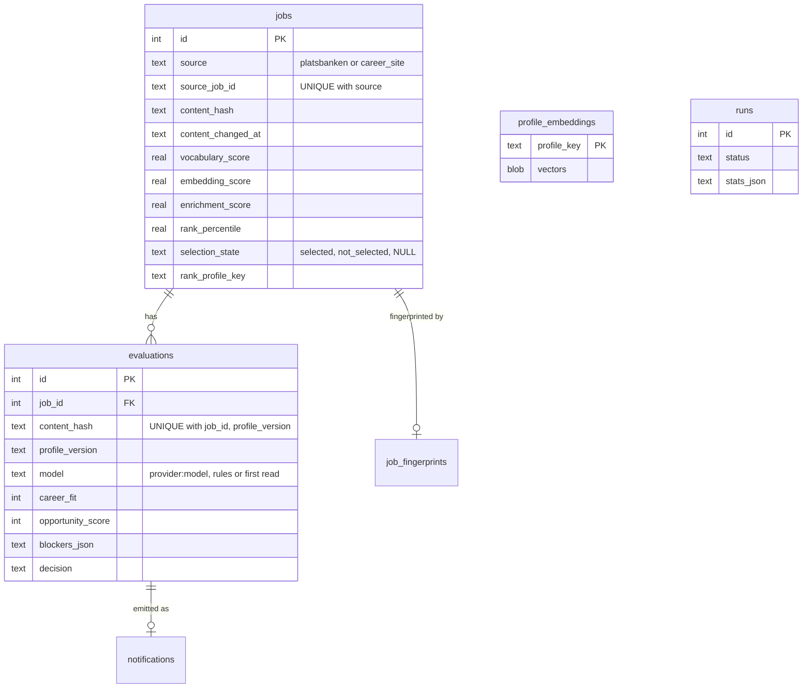
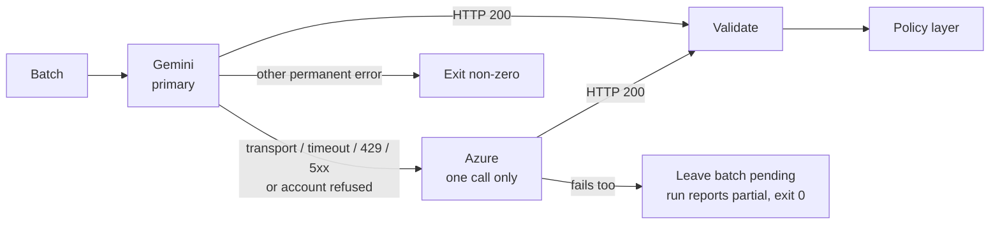

# Architecture

RoleLens is a single Python file with no runtime dependencies outside the
standard library, one SQLite database, and one scheduled invocation. Everything
below describes `rolelens.py`.

The design constraint that shaped all of it: **a scheduled script gets one shot
per tick, unattended, and must never lose a job or silently stop working.** The
second constraint arrived with version 2: **read the whole market, but pay a
model only for what nothing cheaper can decide.**

Keeping it one file is deliberate. It installs by copying one script into
whatever folder a scheduler runs from, it has nothing to resolve at import
time, and the sections below map onto clearly delimited parts of it.

---

## Run shape



A `fetch` run stops after `UPSERT`. An `evaluate` run starts at `RANK`.

---

## Discovery

Discovery costs no model tokens, so it is deliberately over-inclusive: ranking,
not retrieval, decides what is read. `discover()` runs each enabled source and
isolates their failures. A failing source is named in `stats.discovery_failures`
and in an alert line; only a run in which *every* enabled source failed raises,
so the scheduler surfaces it.

### JobStream

`fetch_jobstream` asks Arbetsförmedlingen's JobStream for every ad added,
changed or unpublished since a cursor stored in `meta`. Without a cursor it
replays `jobstream_lookback_hours`; a cursor older than
`jobstream_max_window_hours` is clamped and the gap reported. The request
overlaps the cursor by one second, because a duplicate costs nothing and a gap
loses a job. The cursor advances only after the ads are stored, so a crash
replays the window instead of skipping it. Unpublished ads are counted and
skipped.

### JobSearch

`build_queries` cross-products `search_terms` with `location_terms` (optionally
adding each bare term) and deduplicates case-insensitively. JobStream only
replays recent changes, so keyword queries are how a fresh installation reaches
ads published before it started. A failed query is logged; all queries failing
fails the source. A hit without a description is completed from the ad endpoint.

### Career sites

One collector per applicant-tracking platform turns a public feed into
`JobRecord`s: Teamtailor and Greenhouse, Lever and Ashby JSON boards, Varbi RSS,
SmartRecruiters and Workday JSON search with a detail request per posting, and
SuccessFactors server-rendered pages. `collect_career_sites` then:

- skips a posting whose employer and title match a job stored from another
  source — the same vacancy found twice;
- skips a posting whose content hash is unchanged;
- prefilters it like any ad (country, excluded location, expiry).

Postings are stored under source `career_site` with id `<site name>:<key>`.
Collectors that need detail requests fetch them only for postings not yet
stored, within `career_site_max_details`, pausing `query_delay_ms` between them.
A site that raises anything — an HTTP error or a redesigned page — fails alone.
Full reference: [career-sites.md](career-sites.md).

### Normalisation and prefilter

`normalize_job` flattens a Platsbanken ad; `career_site_job` builds the same
record from a posting, resolving the country from structured data, then from
place names, then from the site's default. Remote and hybrid signals are read
from structured fields and text. `prefilter_reason` drops an ad before it is
stored if it is expired, outside Sweden, in an excluded location while not fully
remote, or has no description.

---

## Persistence

One SQLite file, WAL journal, foreign keys on, `busy_timeout` 5 s. Schema 3.



| Key | Guarantees |
|---|---|
| `jobs UNIQUE(source, source_job_id)` | One row per ad or posting, however many times it is found. |
| `jobs.content_hash` | SHA-256 over the meaningful fields. An edited ad gets a new hash, loses its selection and competes again. |
| `evaluations UNIQUE(job_id, content_hash, profile_version)` | One evaluation per (job version × profile version). |
| `profile_embeddings.profile_key` | The profile is embedded once per model and profile content. |

`profile_version` hashes `matcher_profile.json` (with the knowledge catalogue
attached) and `matcher_rules_v1_1.json` order-independently. Schema migrations
are additive: a v1 or v2 database gains its columns in place, and a newer schema
is refused.

`activate` writes `live_since`; after that only ads first seen or changed at or
after it are live. Historical recovery reads around it — see
[operations.md](operations.md).

---

## Ranking

`rank_new_jobs` scores every ad in the last `ranking_reference_days` that has no
current rank: new or edited ads, ads ranked under another profile or
vocabulary, and ads passed over while embeddings were down.

Three independent orders over the title plus the first 3,000 characters of the
description:

| Order | Source | Cost |
|---|---|---|
| Vocabulary | `role_vocabulary.json`: weighted terms, folded, matched word-aware, each counted once, negative weights for professions the candidate cannot do | free |
| Embeddings | gemini-embedding-001 at 768 dimensions; an ad's score is its best cosine similarity to any section of the matcher profile, embedded separately so one strong area is not averaged away | Vertex tokens |
| Enrichment | JobTech's JobAd Enrichments API: competencies and occupations the ad requests with probability ≥ 0.5, weighted against the concepts the profile itself names (occupations double) | free |

`selection_percentiles` fuses them with reciprocal rank fusion (k = 60), using
fractional ranks so ties stay neutral. An ad is selected when its percentile is
within `evaluate_top_share` of the whole window, or — if embeddings failed for
it — within the wider `degraded_top_share` on vocabulary alone. `explored()`
adds a deterministic random `explore_share` of the rest, hashed on the ad and
its content, so the same ad always gets the same answer. Below 200 ranked ads a
percentile says little, and everything is selected.

The ranking key hashes the profile sections, embedding model, vocabulary,
constants and enrichment switch. When it changes, the window is ranked again.

Embedding failures never stop a run. A per-minute quota is waited out within a
bound; a batch the model rejects is halved, and a single rejected ad ranks on the
vocabulary. `career_profile.json` is never read here.

---

## Candidate selection

```sql
SELECT j.* FROM jobs j
LEFT JOIN evaluations e
       ON e.job_id = j.id
      AND e.content_hash = j.content_hash
      AND e.profile_version = ?
WHERE e.id IS NULL
  AND j.selection_state = 'selected'
  AND j.content_changed_at >= ?      -- only when live mode is active
ORDER BY COALESCE(j.rank_percentile, 1.0),
         j.discovery_score DESC,
         COALESCE(j.published_at, j.first_seen_at) DESC,
         j.id DESC
LIMIT ?
```

"Pending" is not a status column that can drift. A job is pending exactly when
it is selected and has no evaluation for its current content under the current
profile, so an interrupted run leaves the queue correct.

A run takes its snapshot **once**. Before any model call, reposts of an
already-evaluated vacancy (same normalised employer, title, location and body)
are dropped and recorded in `job_fingerprints`.

---

## Screening and the first read

`screen_before_judging` runs the policy layer on an empty evaluation. If the
rules alone produce a hard blocker, the ad is stored with model `rules` and
leaves the queue. Nothing about the candidate is decided here that is not
stated in the profile or dated in the catalogue.

With `triage_model` set, `run_triage_pass` sends the rest to a cheap model in
batches of `triage_batch_size`, with a candidate card built from the profile
(core, experience years, capabilities, target roles, `out_of_scope_work`,
catalogue gaps, Swedish level, eligibility) and the head and tail of each ad.
Only a rejection below fit 50 settles an ad. A pass, a doubtful rejection, a
missing verdict or a duplicated one goes to the judge. A temporary failure sends
that batch to the judge; a refusal or a second failure sends the rest of the run,
with an alert.

---

## Semantic evaluation

### Batching and routing

`iter_batches` fills a batch until 10 jobs or `max_prompt_chars`. The candidate
profile and rules are sent once per batch.



Routing is fixed in code. The fallback never answers a semantic problem: a
successful HTTP 200 carrying malformed content is handled by keeping what is
valid and leaving the rest pending.

### Validation and completeness

Both providers receive the same JSON schema natively, and
`parse_provider_evaluations` still verifies the result against the requested
IDs:

| Condition | Handling |
|---|---|
| Duplicate `source_job_id` | Every copy discarded; the ID stays unresolved. |
| Unknown `source_job_id` | Discarded and recorded. |
| Missing or individually invalid row | Collected as unresolved; later batches still run. |
| Unparseable envelope | Whole batch preserved; the pass stops. |

`error_kind` separates `completeness` (continue, one cleanup pass at the end),
`output` and `transport` (stop, preserve the rest). The cleanup pass is never
recursive and is skipped when the provider already failed this run.

### Second judgement

Scores on ambiguous ads move by up to 20 points between identical calls. An ad
whose `opportunity_score` lands in 52–77 is judged once more and decided on the
mean of both (`combine_judgements`). A hard blocker counts only if both
judgements found one, so a blocker one call imagined cannot erase a match the
other saw. An ad the second call does not answer keeps its first judgement.

---

## Deterministic policy layer

`normalize_evaluation_policy` runs on every evaluation, using the **job text and
the profile**, not the model's opinion, as its evidence:

1. **Swedish.** An explicit negation wins; otherwise an explicit mandatory
   fluent/professional requirement is resolved against the configured CEFR
   level (met / partial with cap 69 / unmet with cap 49 / unknown). A
   Swedish-language ad or a preferred requirement is never a blocker.
2. **Eligibility.** With the profile silent, an explicit citizenship or
   clearance demand is forced to `unknown`. With the profile answering, a
   nationality the candidate lacks is a hard blocker unless the ad offers a
   work-permit route. Background screening alone strips eligibility blockers.
3. **Tenure evidence.** An "N years" requirement marked unmet for lack of
   evidence becomes unknown.
4. **Unmet must-haves** become hard blockers.
5. **Seniority and scope** from the catalogue: years beyond the dated roles,
   senior and management titles, student roles.
6. **Years in a named field** cap the ad at a stretch and keep a card that would
   otherwise have been one.

Every change is recorded in `_policy_changes`. Then `classify_decision` takes
only validated numbers and blocker types:

```python
if "hard" in blocker_types:                                   return "store_no_notify"
if genuine_unknown_blocker and fit >= 85 and opp >= 55:       return "notify_verify"
if opp >= 85:                                                 return "notify_strong"
if opp >= 70:                                                 return "notify_good"
if opp >= 60 and fit >= 75:                                   return "notify_stretch"
return "store_no_notify"
```

---

## Notification

Delivery happens **only after every batch, including the cleanup pass, has
completed.** Undelivered notify decisions are ranked globally by
`opportunity_score`, capped at `max_notifications_per_run`, and deduplicated a
second time. A vacancy already delivered under an earlier evaluation is never
delivered again.

### stdout is a contract

- **stdout** carries user-facing content only: cards, alert lines, then one
  summary line — and nothing at all when there is no match and no problem.
- **stderr** carries every operational log.
- A non-zero exit makes the scheduler surface a failure.

---

## Retry and deferral

Pending-ness is derived from state, so everything degrades into "still pending":

| Failure | Behaviour | Exit |
|---|---|---|
| One discovery source fails | The others run; alert line | 0 |
| Every discovery source fails | Nothing to persist | 2 |
| Embeddings unavailable | Vocabulary-only ranking at the wider share; alert | 0 |
| Enrichment unavailable | Ranks on vocabulary and embeddings | 0 |
| First-read model refuses or fails twice | The judge reads the rest; alert | 0 |
| Provider transport/timeout/429/5xx or refusal | One fallback call | 0 |
| Both providers fail | This batch and later ones preserved | 0, partial |
| HTTP 200, envelope fine, IDs missing | Save valid rows, continue, one cleanup pass | 0 |
| HTTP 200, unparseable envelope | This batch and later ones preserved | 0, partial |
| Monthly budget reached | Judging paused, jobs wait; alert | 0 |
| Emergency runtime budget exhausted | Remaining batches deferred | 0 |
| Candidate ceiling truncates the snapshot | Run reports itself incomplete | 0 |
| Permanent provider or configuration error | Fail loudly | 2 |
| Second concurrent run | Lock not acquired, exit quietly | 0 |

Bounded HTTP retry with `Retry-After` support and jittered backoff sits under
all of this, for 408, 409, 425, 429, 500, 502, 503 and 504.
